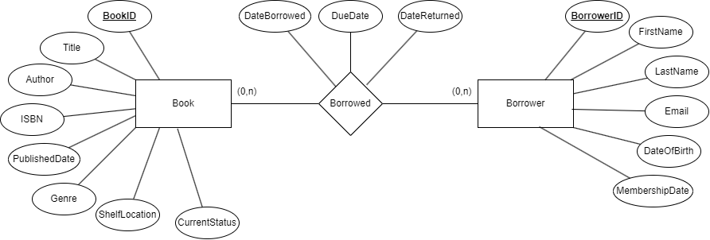
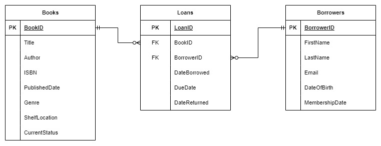
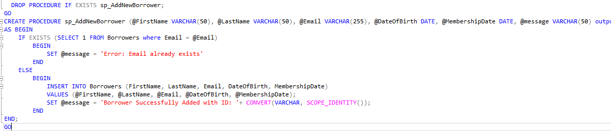
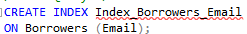
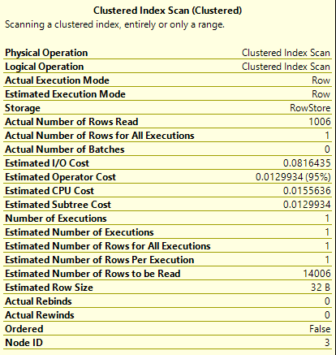
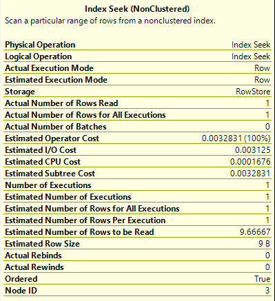

# Tech-Lib-Project

## 1. Design

### Entity-Relationship Model (ERM)

### Database Schema Design

## 2. Design the Relational Schema using MS SQL:

[Database and Table Creation](Database-Creation-and-Schema.sql)

## 3. Build and Seed the Database:

- [Books](BooksSeed.sql)
- [Loans](LoansSeed.sql)
- [Borrowers](BorrowersSeed.sql)

## 4. Complex Queries and Procedures

1.  [List of Borrowed Books](Queries-and-Procedures/1-ListofBorrowedBooks.sql): Retrieve all books borrowed by a specific borrower, including those currently unreturned.
2.  [Active Borrowers with CTEs](Queries-and-Procedures/2-ActiveBorrowersWithCTE.sql): Identify borrowers who've borrowed 2 or more books but haven't returned any using CTEs.
3.  [Rank Borrowers based on frequency](Queries-and-Procedures/3-RankBorrowersBasedOnFrequency.sql): Rank borrowers based on borrowing frequency.
4.  [Identify the most popular genre for a given month using Joins and Window Functions:](Queries-and-Procedures/4-MostPopularGenreForAGiveMonth.sql): Rank borrowers based on borrowing frequency.
5.  [Stored Procedure - Add New Borrowers](Queries-and-Procedures/5-ValidateEmailWhenAddingBorrower.sql)
6.  [Database Function - Calculate Overdue Fees](Queries-and-Procedures/6-CalculateOverdueFees-DatabaseFunction.sql)
7.  [Database Function - Book Borrowing Frequency](Queries-and-Procedures/7-BookBorrowingFrequency-DatabaseFunction.sql)
8.  [Overdue Analysis](Queries-and-Procedures/8-OverdueAnalysis.sql): List all books overdue by more than 30 days with their associated borrowers.
9.  [Author Popularity using Aggregation](Queries-and-Procedures/9-RankAuthorsByBorrowingFrequencyOfTheirBooks.sql): Rank authors by the borrowing frequency of their books.
10. [Genre Preference by Age using Group By and Having:](Queries-and-Procedures/10-DeterminePreferredGenreOfDifferentAgeGroupsOfBorrowers.sql): Determine the preferred genre of different age groups of borrowers. (Groups are (0,10), (11,20), (21,30)…)
11. [Stored Procedure - Borrowed Books Report](Queries-and-Procedures/11-BorrowedBooksReport.sql)
12. [Trigger Implementation: ](Queries-and-Procedures/12-TriggerToAuditLogTableWhenUpdateBookStatus.sql) Design a trigger to log an entry into a separate AuditLog table whenever a book's status changes from 'Available' to 'Borrowed' or vice versa. The AuditLog should capture BookID, StatusChange, and ChangeDate.
13. [SQL Stored Procedure with Temp Table: ](Queries-and-Procedures/14-RetrieveAllBorrowersWhoHaveOverDueBooks.sql) Design a stored procedure that retrieves all borrowers who have overdue books. Store these borrowers in a temporary table, then join this temp table with the Loans table to list out the specific overdue books for each borrower.
14. [BONUS: Weekly Peak Days: ](Queries-and-Procedures/BONUS-WeeklyPeakDays.sql) The library is planning to employ a new part-time worker. This worker will work 3 days weekly in the library. From the data you have, determine the most 3 days in the week that have the most share of the loans and display the result of each day as a percentage of all loans. Sort the results from the highest percentage to the lowest percentage. (eg. 25.18% of the loans happen on Monday...)

## 5. Indexes

[Indexes:](Indexes.sql) Created Indexes to improve performance

### Test Index Speed on Query Nº5

#### Query:

#### Index used:

#### When calling this storage Procedure we get

1. Performance Without Index: We can see in the image bellow that the Actual Number of Rows Read is 1006.

2. Performance With Index: After running this stored procedure with an index, the actual number of rows goes down to only 1. Additionally, the estimated operator, I/O, CPU, and Subtree values are much lower. We can also note that the estimated number of rows to be read decreases significantly from O(n) in the first run (which, in that case, n was 14006) to approximately 9.66667 in the second run. This is close to O(log n), which is the worst-case scenario for a B-tree index.

